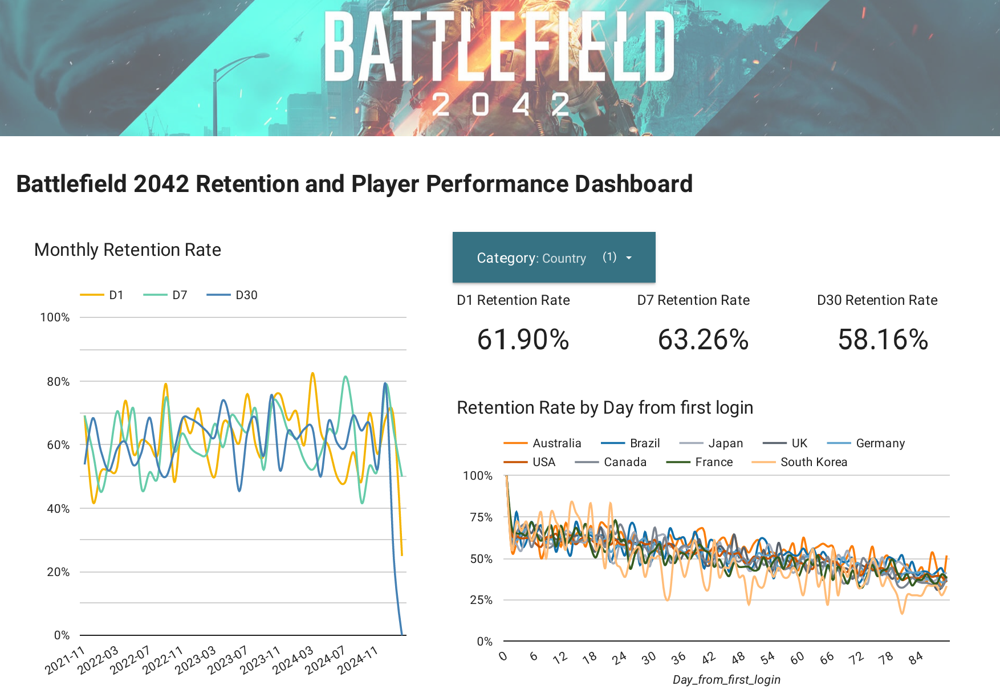

# **Battlefield Gameplay Data Simulation & Retention Analysis**🚀🎮

This project simulates **gameplay session data** for a multiplayer game and performs **player retention analysis** using **BigQuery SQL queries**. The dataset is designed to model **realistic player engagement**, including **session activity drop-off over time**, player attributes, match performance, and retention trends. A **Looker Studio dashboard** is also included to visualize key insights.

---

## **Project Structure**  

📂 **Repository Contents**  

- **`battlefield_gameplay_data_simulation.py`**  
  - Python script to **simulate player session data** with realistic **drop-off behavior**, game modes, performance metrics, and retention trends.  
  - Saves the dataset as a CSV file for further analysis.  

- **`bigquery_sql_script.md`**  
  - Contains **SQL queries** to analyze retention rates using **BigQuery**.  
  - Queries include **cohort-based retention, daily retention trends, and segmented retention by country, platform, match mode, and role**.  

- **`battlefield_gameplay_data.csv`**  
  - The **simulated dataset** generated from the Python script.  
  - Includes session dates, player attributes, match performance, and calculated statistics.  

- **`battlefield_retention_dashboard.pdf`**  
  - A **Looker Studio dashboard** visualizing retention trends, engagement drop-off, and performance metrics.  
  - Provides insights into **player activity, retention rates, and gameplay behavior over time**.  

Below is a snapshot of the **Looker Studio dashboard**.



🔗 For full insights, **[view full dashboard (PDF)](battlefield_retention_dashboard.pdf)**.

---

## **Key Features**  

### ✅ **Gameplay Data Simulation**
- Simulates **player sessions** over multiple years from the **game’s release (Nov 12, 2021) until today**.  
- Models **player drop-off**, where session frequency decreases over time.  
- Generates player attributes such as **game mode, role, platform, and country**.  
- Adds **performance metrics (kills, deaths, assists, revives, achievements, etc.)** that scale with player experience.  

### ✅ **BigQuery SQL Analysis**
- Calculates **retention rates by player cohorts** (monthly-based).  
- Tracks **daily player retention** over the first **30 days**.  
- Segments retention analysis by **country, platform, match mode, and role**.  

### ✅ **Looker Studio Dashboard**
- **Visualizes player retention trends** over time.  
- Displays **engagement trends, drop-off patterns, and performance stats**.  
- Helps in understanding **which player segments retain better** and how their **gameplay performance evolves**.  

---

## **How to Use**  

### **1️⃣ Simulate Gameplay Data**
Run the **Python script** to generate the gameplay dataset:  

```bash
python battlefield_gameplay_data_simulation.py
```
This will create `battlefield_gameplay_data.csv`.  

### **2️⃣ Analyze Data with BigQuery**
Upload the CSV file to **BigQuery** and run the queries from `bigquery_sql_script.md` to analyze **player retention trends**.

### **3️⃣ Explore the Looker Studio Dashboard**
Open `battlefield_retention_dashboard.pdf` to explore **visual insights on retention rates and gameplay trends**.

---

## **Potential Use Cases**  

🚀 **Retention Analysis** – Understand how players engage over time and identify **drop-off patterns**.  
📊 **Performance Tracking** – Analyze **game mode popularity, player skill progression, and session activity**.  
🕹️ **Game Balancing Insights** – Use performance data to **fine-tune game mechanics and balance player roles**.  
🔍 **Marketing & Monetization** – Identify which **player segments retain best** and optimize engagement strategies.  

---

### 📩 **Contact**  

For questions, feedback, or collaboration opportunities, feel free to reach out:

- Name: Kenith C.
- Email: [kenith.ckl@gmail.com](mailto:kenith.c@gmail.com)
- LinkedIn: [linkedin.com/in/kenithckl](https://linkedin.com/in/kenithckl)
- GitHub: [github.com/ken1th](https://github.com/ken1th)

---
# License

This project is licensed under the MIT License. Feel free to use, modify, and distribute this project.🎮📊